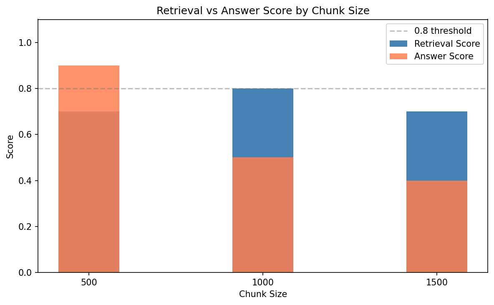

# FAR/DFARS Regulatory Document Assistant
### Retrieval-Augmented Generation (RAG) System

A local, fully private RAG application for querying Federal Acquisition Regulation (FAR) and Defense Federal Acquisition Regulation Supplement (DFARS) documents using natural language. Built with LangChain, ChromaDB, HuggingFace embeddings, and Ollama - no API costs, no data leaving your machine.

## Overview

Defense acquisition professionals work with dense, highly specific regulatory language across hundreds of FAR/DFARS parts. Finding a specific clause number, dollar threshold, or procedural requirement means manually searching through thousands of pages.

This system lets you ask plain English questions and get grounded, cited answers directly from the regulation text - with source document and page number for every response.

**Example queries:**
- *"What clause is required for safeguarding covered contractor information systems?"*
- *"What are the procedures for obtaining certified cost or pricing data?"*
- *"What is the deadline for offerors to submit proposals when no time is specified?"*

## Key Design Decisions

**Why MMR over pure similarity search?**
FAR regulations repeat concepts across many adjacent sections. Pure similarity search returns near-duplicate chunks from the same page. MMR's diversity penalty ensures retrieved chunks cover different aspects of the regulation, producing more complete answers.

**chunk_size=500**  
Determined experimentally. Tested 500, 1000, and 1500 - smaller chunks produced higher answer scores (90%) despite slightly lower retrieval scores (70%). Larger chunks retrieved well but buried specific facts (clause numbers, dollar thresholds) inside too much surrounding text, making LLM extraction harder.

**all-MiniLM-L6-v2**  
Fast, lightweight (384 dimensions), runs on CPU with no GPU required. Strong performance on English semantic similarity. No API cost - embeddings are generated locally and cached in ChromaDB.

**Ollama/Mistral**  
Fully local inference - regulatory documents may contain sensitive contract information that should not be sent to external APIs. Mistral 7B provides strong instruction following at a size that runs on consumer hardware.

## Evaluation

An evaluation dataset of 5 questions with known answers was used to measure retrieval and answer quality across chunk sizes.

| chunk_size | chunk_overlap | num_chunks | retrieval | answer |
|---|---|---|---|---|
| 500  | 100 | 1007 | 70% | 90% |
| 1000 | 200 | 499  | 80% | 50% |
| 1500 | 300 | 334  | 80% | 40% |

**Key finding:** Retrieval score and answer score move in opposite directions as chunk size increases. Larger chunks retrieve more context but dilute specific facts, making LLM extraction harder. Chunk size should be treated as a hyperparameter tuned against a task-specific evaluation dataset - not set arbitrarily.



*Retrieval vs. answer score across chunk sizes - chunk_size=500 produced the highest answer score (90%) despite lower retrieval score (70%), demonstrating that retrieval quality and answer quality are not the same metric.*

## Stack

| Component | Technology |
|---|---|
| Orchestration | LangChain |
| Vector store | ChromaDB |
| Embeddings | HuggingFace sentence-transformers |
| LLM | Ollama / Mistral 7B |
| Document loading | LangChain PyPDFLoader |
| Notebook | Jupyter / VS Code |

## RAG Pipeline

```text
PDF Documents (FAR Parts 12, 15, 46)
        │
        ▼
┌─────────────────────┐
│   Document Loader   │  PyPDFLoader - preserves page metadata and titles
└─────────┬───────────┘
          │
          ▼
┌─────────────────────┐
│   Text Splitter     │  RecursiveCharacterTextSplitter
│   chunk=500 / ov=100│  Splits on paragraph → sentence → word boundaries
└─────────┬───────────┘
          │
          ▼
┌─────────────────────┐
│  Embedding Model    │  all-MiniLM-L6-v2 (384-dim, runs on CPU, free)
│  HuggingFace local  │  Normalized vectors for cosine similarity
└─────────┬───────────┘
          │
          ▼
┌─────────────────────┐
│   ChromaDB          │  Persisted locally - no re-embedding on restart
│   Vector Store      │  1007 chunks across 3 FAR parts
└─────────┬───────────┘
          │
    ┌─────┴──────┐
    │  MMR Query │  k=5, fetch_k=20 - balances relevance and diversity
    └─────┬──────┘
          │
          ▼
┌─────────────────────┐
│   RAG Chain         │  Retrieved chunks injected into grounding prompt
│   Ollama/Mistral    │  Multi-turn chat history for follow-up questions
└─────────┬───────────┘
          │
          ▼
   Grounded answer with FAR part and page citations
```

## Setup

### Prerequisites
- Python 3.10+
- [Ollama](https://ollama.ai) installed and running

### Installation

```bash
git clone https://github.com/DarrellS0352/FAR-DFARS-RAG-system-with-evaluation.git
cd FAR-DFARS-RAG-system-with-evaluation

python -m venv venv
venv\Scripts\activate  # Windows
pip install -r requirements.txt
```

### LLM Setup
```bash
ollama pull mistral
ollama serve
```

### Add Documents
Drop FAR/DFARS PDFs into a `data/` folder. Free source: [acquisition.gov/far](https://www.acquisition.gov/far)

### Run
Open `Military_Maintenance_Manual_Assistant_RAG_app.ipynb` in VS Code or Jupyter and run cells sequentially. The vector store persists to disk after first ingest - subsequent runs load from disk automatically.


## Potential Improvements
- **Domain embeddings** - fine-tune all-MiniLM-L6-v2 on FAR/DFARS terminology
- **Streamlit UI** - chat interface with document upload for non-technical users
- **RAGAS evaluation** - replace keyword matching with semantic similarity metrics for more robust evaluation

## Background

Built as a portfolio project demonstrating GenAI/LLM engineering skills with direct domain relevance. The FAR/DFARS regulatory framework governed military aviation logistics contracts I worked on at a previous employer.

## License
MIT
